import Tabs from '@theme/Tabs';
import TabItem from '@theme/TabItem';


# Quickstart

## Introduction
This guide will walk you through the process of generating a link that allows your customers to connect their devices with Texture.

## Generate a setup link

There are three ways to generate a link:
1. The Texture API
2. The Texture SDK (Javascript, React, or React Native)
3. The Texture Dashboard

### Texture API and SDK

#### Get Your API Key
Go to the [Texture Dashboard Developer tab](https://dashboard.texturehq.com/developer) to obtain an API key

#### Generate a link

<Tabs>
<TabItem value="js" label="API (Javascript)">

Node v18 + required

``` javascript
#!/usr/bin/env node

const textureApiUrl = "https://api.texturehq.com";
const apiKey = process.env.TEXTURE_API_KEY || "<your-api-key-goes-here>";

console.log(`Using API key: ${apiKey}`);

// Node v18 has fetch built in
fetch("https://api.texturehq.com/v1/connections", {
  method: "POST",
  headers: {
    "Content-Type": "application/json",
    "Texture-Api-Key": apiKey,
  },
  body: JSON.stringify({
    referenceId: "9bb290c8-fe97-46ce-92a8-952823164277",
    redirectUrl: "http://localhost:8000",
    tags: ["tag1", "tag2"],
    clientName: "Energy Demo"
    customerInfo: {
      email: "example@example.com",
      phone: "555-555-0100",
      firstName: "John",
      lastName: "Doe",
    },
  }),
})
  .then((response) => {
    if (response.ok) {
      return response.json();
    }
    throw new Error(
      `Failed to make request: ${response.status}, ${response.statusText}`
    );
  })
  .then((responseJSON) => {
    console.log(responseJSON);
  })
  .catch((error) => {
    console.error("Failed to make request", error);
  });
```
</TabItem>

<TabItem value="py" label="API (Python)">
``` python
import requests

# URL to POST to
url = "https://api.texturehq.com/v1/connections"

# The header to include with the request
headers = {
    "Texture-Api-Key": "<your-api-key-goes-here>",
    "Content-Type": "application/json",
}

# JSON body data
data = {
    "referenceId": "9bb290c8-fe97-46ce-92a8-952823164277",
    "redirectUrl": "http://localhost:8000",
    "tags": ["tag1", "tag2"],
    "clientName": "Energy Demo",
    "customerInfo": {
        "email": "example@example.com",
        "phone": "555-555-0100",
        "firstName": "John",
        "lastName": "Doe",
    },
}

# Make the POST request
response = requests.post(url, headers=headers, json=data)

# Check the response
if response.status_code == 200:
    print("Successfully sent POST request.")
    print("Response:", response.json())
else:
    print(f"Failed to send POST request. Status code: {response.status_code}")
    print("Response:", response.text)
```
</TabItem>

<TabItem value="js-sdk" label="JavScript SDK">

Install using npm:
``` bash
$ npm install @texturehq/connect-sdk
```

Or, install using yarn:
``` bash
$ yarn add @texturehq/connect-sdk
```

Create a button to generate a setup link:

``` javascript
import { createConnectSession } from "@texturehq/connect-sdk";

const texture = createConnectSession({
  connectApiKey: "<your-api-key-goes-here>",
  connectOptions: {
    referenceId: "9bb290c8-fe97-46ce-92a8-952823164277",
    clientName: "Name for your application",
    redirectUrl: "http://localhost:8000",
    tags: ["tag1", "tag2"],
    manufacturerFilters: { manufacturers: ['honeywell', 'daikin'] },
    customerInfo: {
      email: "example@example.com",
      phone: "555-555-0100",
      firstName: "John",
      lastName: "Doe",
    },
  },
  onSuccess: ({ scopedKey }) => {
    // The scopedKey returned is a string that can be used to make requests to Texture API
    // to retrieve data related to the newly connected account
  },
  onError: ({ type, reason }) => {
    // The error object contains a type and reason
    // type is identifier for the type of error that occurred
    // reason is a string that provides more information about the error
    // type 'popup-blocked' means that the popup window was blocked from opening
    // type 'popup-closed' means that the popup window was closed before the connection was established
  },
});

document.querySelector("#app").innerHTML = `
  <div>
      <button id="texture-connect" type="button">Connect device(s) with Texture</button>
  </div>
`;

const textureConnectButton = document.querySelector("#texture-connect");
textureConnectButton.addEventListener("click", () =>
  texture.open({
    width: 600,
    height: 800,
  })
);
```
</TabItem>

<TabItem value="react-sdk" label="React SDK">

Install using npm:
``` bash
$ npm install @texturehq/react-connect-sdk
```

Or, install using yarn:
``` bash
$ yarn add @texturehq/react-connect-sdk
```

Create a button to generate a setup link:
``` javascript
import { useCreateConnectSession } from "@texturehq/react-connect-sdk";

function App() {
  const { open } = useCreateConnectSession({
    connectApiKey: "<your-api-key-goes-here>",
    connectOptions: {
      referenceId: "9bb290c8-fe97-46ce-92a8-952823164277",
      clientName: "Name for your application",
      redirectUrl: "http://localhost:8000",
      tags: ["tag1", "tag2"],
      manufacturerFilters: { manufacturers: ['honeywell', 'daikin'] },
      customerInfo: {
        email: "example@example.com",
        phone: "555-555-0100",
        firstName: "John",
        lastName: "Doe",
      },
    },
    onSuccess: (session) => {
      console.log(session);
    },
    onError: (error) => {
      console.log(error);
    },
  });

  return (
    <>
      <div className="card">
        <div style={{ display: 'flex', justifyContent: 'center' }}>
          <button onClick={() => open()}>Open Texture</button>
        </div>
      </div>
    </>
  );
}

export default App;
```
</TabItem>


<TabItem value="react-native-sdk" label="React Native SDK">

Install using npm:
``` bash
$ npm install @texturehq/react-native-connect-sdk
```

Or, install using yarn:
``` bash
$ yarn add @texturehq/react-native-connect-sdk
```

Create a button to generate a setup link:

To do this, wrap `TextureConnect` around a component, and your component will become a button that opens the Connect flow from your React Native code.

``` javascript
import { TextureConnect } from '@texturehq/react-native-connect-sdk';
//...
  return (
    <GestureHandlerRootView style={styles.container}>
      <TextureConnect 
          connectApiKey="<your-api-key-goes-here>"
          connectOptions={{
            clientName: 'Texture Connect',
            referenceId: '123',
            redirectUrl: 'exp+react-native-example://',
            manufacturerFilters: { manufacturers: ['honeywell', 'daikin'] },
          }}
          onError={(type, reason) => console.log(type, reason)}
          onSuccess={(scopedKey) => console.log("Texture Scoped Key", scopedKey)}
        >
        <Text>Texture Connect</Text>
      </TextureConnect>
      <StatusBar style="auto" />
    </GestureHandlerRootView>
  );

```
</TabItem>

</Tabs>

### Texture Dashboard

1. Go to the [Texture Dashboard](https://dashboard.texturehq.com/home).
2. Enter the user's information.
3. Click submit.

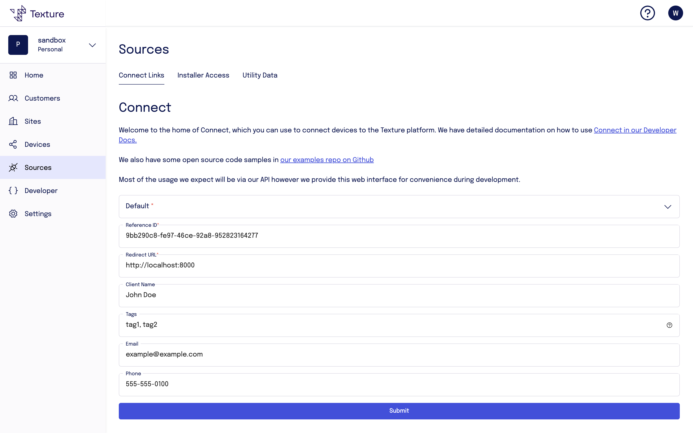

## Customer Device Connect Flow

Once the user follows the link or is prompted to set up their device, they will be guided through the Texture Connect flow. This process is designed to be user-friendly and intuitive. Here's what the user can expect:


1. **Welcome Screen**: The user is greeted with a welcome screen that introduces the connection process.

   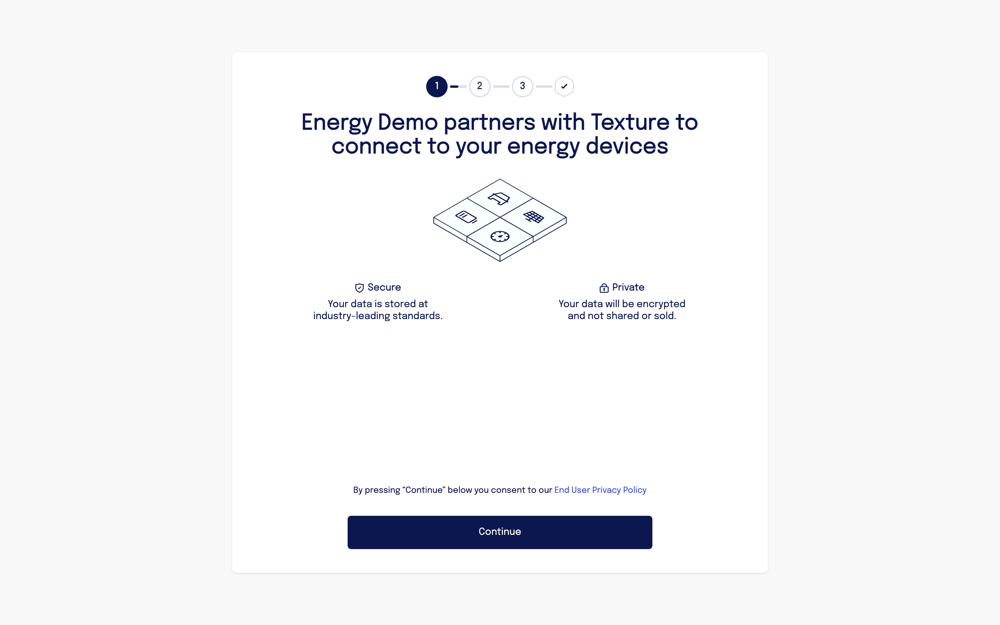

2. **User Information**: The user enters their name, contact, and address information.

   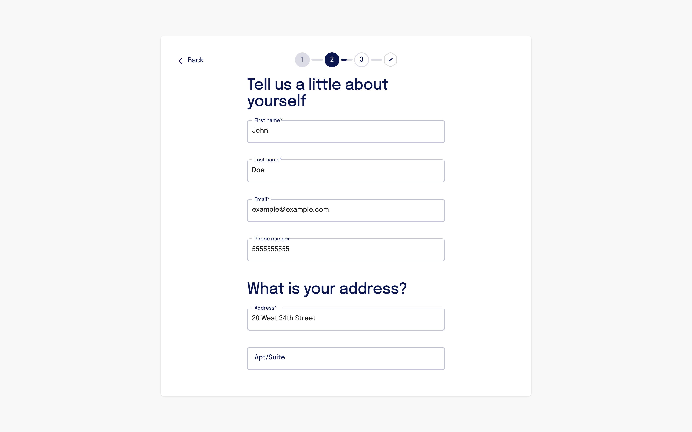
   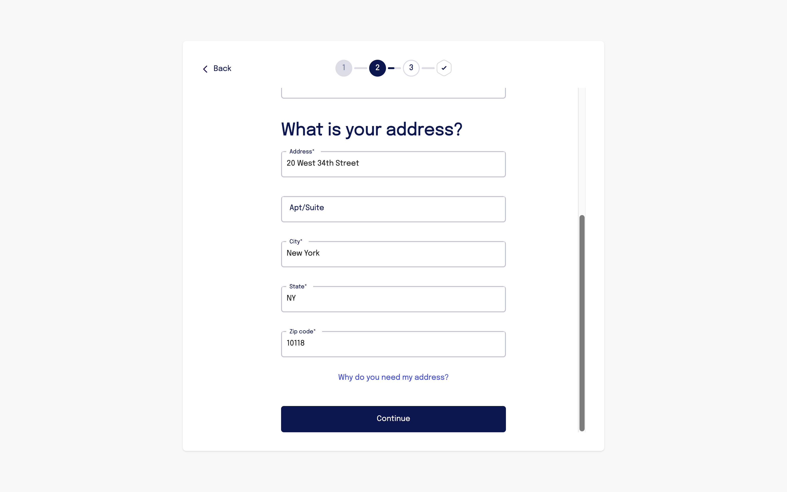

3. **Device Set Up**: The user selects their device manufacturer, signs into their account, and selects devices to connect.

   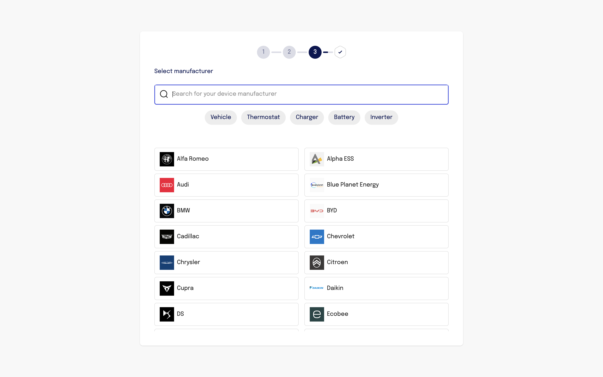
   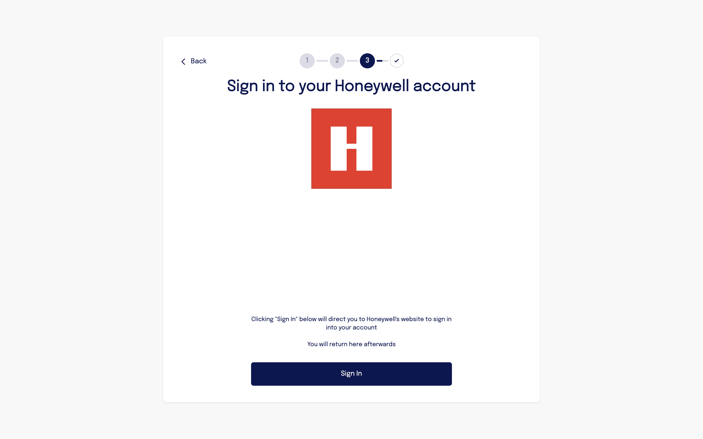
   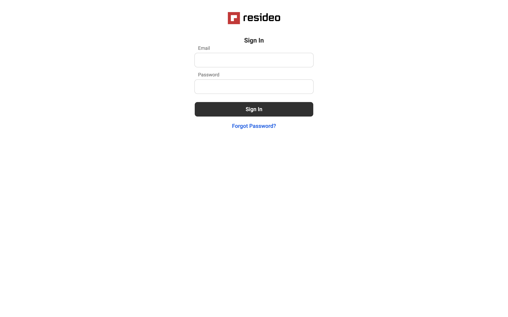
   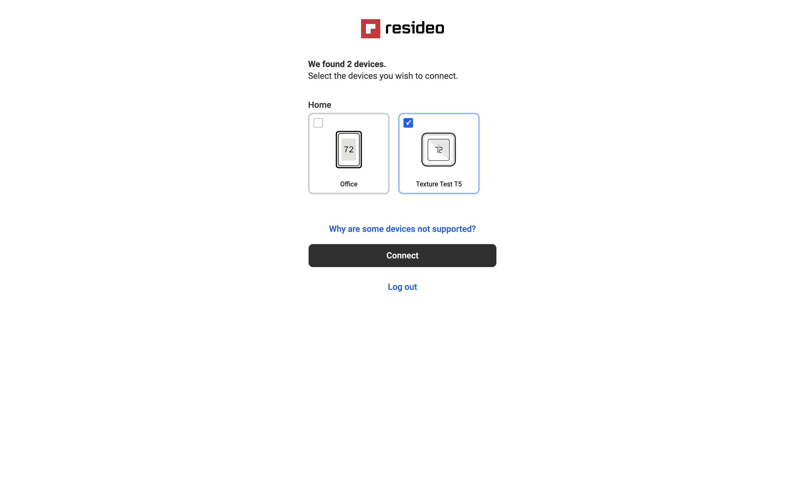

4. **Success**: The user's device is set up! When they click continue they will be sent to the `redirectUrl` you provided.

   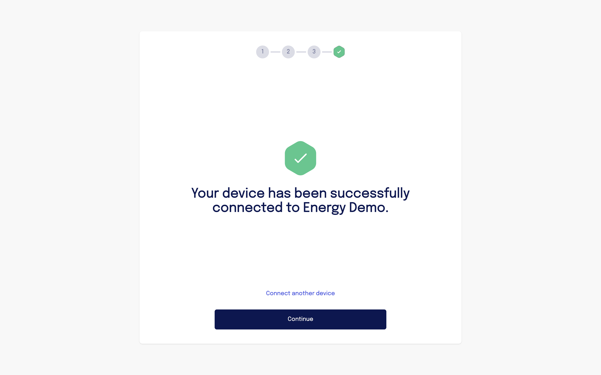


## Viewing Customer Device Information

Go the the [Texture Dashboard](https://dashboard.texturehq.com/home).

### Customers
Click "Customers" to see customers that have connected a device.

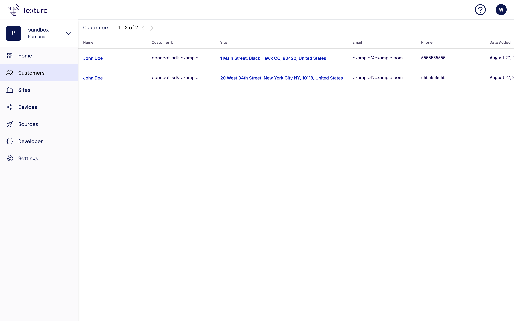

### Sites
Click "Sites" to see customer device locations. 

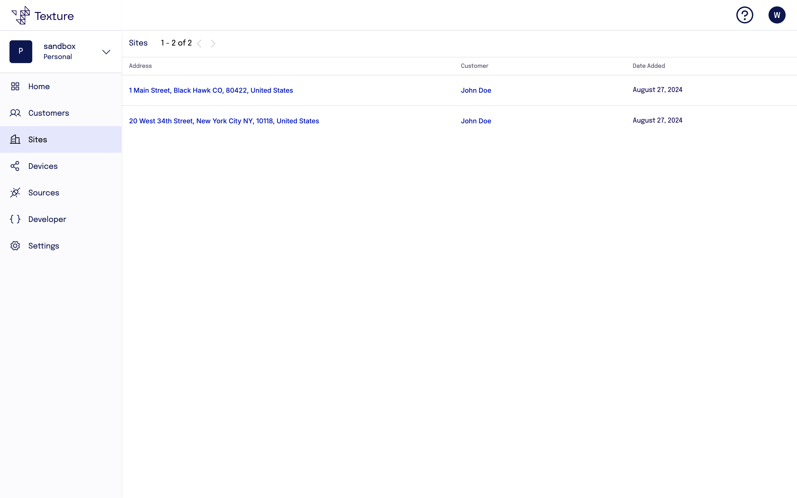

### Devices
Click "Devices" to see connected customer devices.

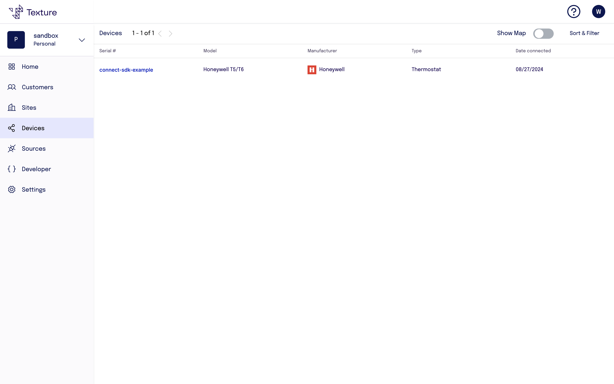

Click on the device "Serial Number" to see detailed informaiton about the device.

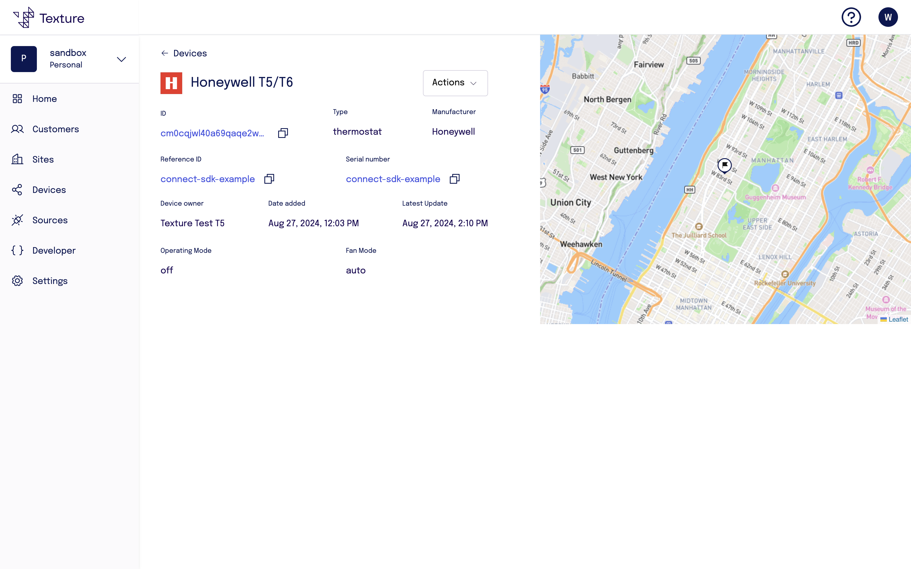
