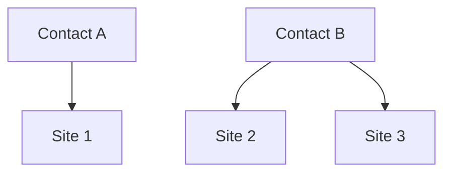

---
---

import { Subtitle } from '@components/Subtitle';

# Contacts

<Subtitle>An individual linked to Sites and energy activity in your network</Subtitle>
Contacts are individual people—like homeowners, technicians, or program participants—connected to one or more Sites in the Texture Platform. Most commonly, a Contact is linked to a single Site, but they can be associated with multiple Sites when needed.

Each Contact record stores their personal details and links them to the infrastructure they use or manage. Texture automatically aggregates their energy data, device activity, and event history into one place—making it easy to view, track, and act on across the Dashboard and API.

The Contact model is designed to mirror common CRM and CIS person records, so you can sync identity and engagement across systems.



---

## Why Contacts?

By creating a Contact, you can:

- Link one or more **Sites** to a single individual
- View **aggregate energy metrics** across all linked infrastructure
- Track **utility territory**, market, and ISO based on their Sites
- Centralize **contact info** (name, email, phone)
- Monitor key events in a consolidated **Activity Feed**
- Manage **access and automation** via API and Dashboard
- Enable **person-level triggers**, controls, and eligibility logic across workflows

---

## Contact Profile

Each Contact includes:

- **Identifying Info** — First/last name, email, phone number
- **Location Data** — Sourced from associated Sites or directly entered
- **Links** — References to any owned Sites or Devices
- **Reference ID** — Optional external identifier for cross-system mapping

When linked to Sites, the Contact's usage and events are visible in one place. This includes energy totals, device status, billing history, and telemetry trends.

---

## Dashboard View

The Contact view in the **Dashboard** includes:

### 1. Contact Details

- Name, email, phone
- Linked Sites and address info
- Utility/market context (e.g., ISO, territory)

### 2. Energy Usage

- Combined usage, production, storage, and emissions across all Devices and Sites

### 3. Devices

- Current device status (e.g., charge level, setpoint, state)

### 4. Activity Feed

- Notable system events tied to their infrastructure (e.g., "Device Offline")

### 5. Connect Sessions

- If the Contact used [Texture Connect](/integrations/texture-connect), view onboarding status and session history

---

## Managing Contacts via API

Texture offers endpoints to create, fetch, and manage Contacts:

### List Contacts

```http
GET /contacts
```

Returns all Contacts in your Workspace.

### Get a Contact

```http
GET /contacts/{id}
```

Returns metadata, Sites, and Devices for a specific Contact.

### Delete a Contact

```http
DELETE /contacts/{id}
```

Removes the Contact from the workspace.

### Get Associated Sites

```http
GET /contacts/{id}/sites
```

Returns all linked Sites.

Texture avoids duplicate Contacts by checking for existing records with matching email, reference ID, or address. You can override or manually link as needed.

:::tip
Use `referenceId` to maintain consistent Contact records across your systems. This prevents duplicate Contacts when syncing data from multiple sources.
:::

---

## Example Workflow

1. **Create or Identify**  
   Create a Contact via `POST /contacts`, or through a Connect session.

2. **Link Infrastructure**  
   Devices and Sites auto-link based on address or reference match.

3. **Aggregate Data**  
   Energy and event data rolls up under the Contact profile.

4. **Monitor Activity**  
   Events like device offline or billing updated show in the feed.

5. **Take Action**  
   Use the API or workflows to automate messaging or control.

---

## Best Practices

- Use **referenceId** to sync with internal systems
- Keep **ownership clear** — One Contact should own each Site or Device
- **Protect PII** — Limit access to personal data and audit usage
- Set up **Webhooks** — Subscribe to Contact events like new device linked or session started

:::caution
Contact data contains personal information. Ensure your API access controls and webhook endpoints follow data protection best practices and comply with relevant privacy regulations.
:::

---

## Next Steps

- **Explore the [API Reference](/api)** for full payloads and schemas
- **Use the Dashboard** for interactive management
- **Combine with Commands and Schedules** to automate actions

Contacts provide the connective tissue between infrastructure and people—enabling insight, coordination, and trust at every layer.
