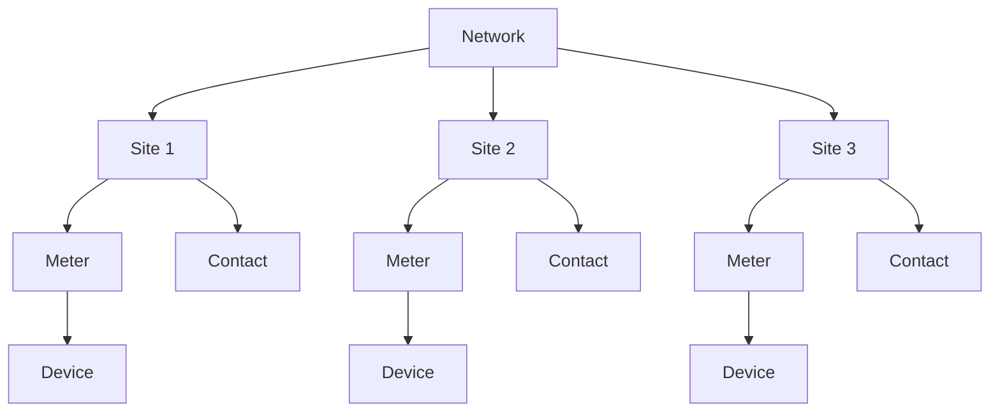

---
---

import { Subtitle } from '@components/Subtitle';

# Network
<Subtitle>The structured graph of sites, assets, and entities within a workspace</Subtitle>

A **Network** in Texture is the full set of energy infrastructure modeled within a workspace. It includes sites, devices, meters, contacts, and their relationships—forming a coherent, observable system.

Networks are the foundation for control, data sharing, and automation. They define what exists, how it's connected, and what can be orchestrated.

## What is a Network?

Each workspace models a **Network**: a structured, interrelated graph of energy assets and participants. This includes:

- **Sites** — Physical locations like homes, facilities, or feeders
- **Devices** — Controllable or monitored equipment (batteries, HVAC, EVSEs, etc.)
- **Meters** — Utility or sub-metering sources, virtual or physical
- **Contacts** — Individuals or orgs tied to specific assets or enrollments
- **Regions and Locations** — Geospatial grouping, regulatory boundaries, and physical addresses

This graph is continuously updated via ingestion, user action, or workflow automation. It's how Texture represents "what's on the grid" in a way that can be observed, reasoned about, and acted on.

## Why It Matters

Most energy systems lack a consistent, connected view of the infrastructure they manage. Data lives in silos, and relationships between assets are lost.

With Texture:

- You **see the full system**—not just individual devices
- You can **coordinate actions** based on relationships (e.g. control all DERs at a site)
- You can **track state** across assets, participants, and programs

The Network provides the data foundation for all workflows, agents, and analytics.

## Network Composition

A network comprises these core components:

| Component | Role in Network |
|-----------|----------------|
| **Sites** | Physical locations that contain energy infrastructure |
| **Meters** | Energy flow measurement and monitoring points |
| **Devices** | Controllable or monitored energy assets at each site |
| **Contacts** | People and organizations associated with network assets |

These components form interconnected relationships that enable the network to function as a unified energy system.

:::tip
You can traverse the network via API or UI—for example, from a region to sites, then to devices, then to contact records and enrollments.
:::

## How Networks Are Used

Texture leverages the workspace network for:

- **Workflow targeting** — Scope actions to relevant sites, fleets, or participants
- **Agent logic** — Detect change across graph boundaries (e.g. "flag all sites with 2+ offline devices")
- **Data access** — Share structured context with dashboards, partners, or analytics tools
- **Control orchestration** — Group assets for dispatch or automated action

## Related Pages

- [Sites](./sites)
- [Devices](./devices)
- [Contacts](./contacts)
- [Workspaces](./workspaces)
