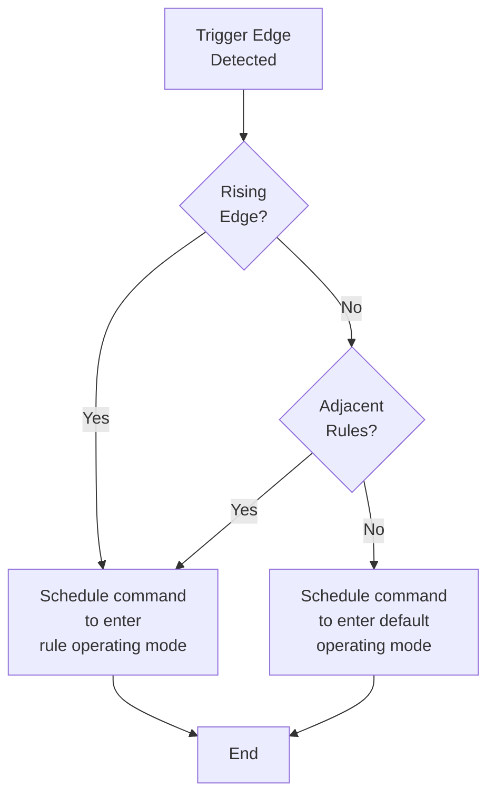

# Schedules

import { Subtitle } from '@components/Subtitle';

<Subtitle>Automate device operations with intelligent scheduling capabilities</Subtitle>

**Schedules** enable you to automate device operations by defining time-based rules that control when devices should enter specific operating modes. Whether you're optimizing battery charging cycles, managing thermostat settings, or coordinating demand response events, Texture's scheduling system provides precise, reliable automation across all supported device types.

## Why Schedules?

Manual device control doesn't scale. As your device fleet grows, the complexity of optimizing operations across hundreds or thousands of devices becomes overwhelming. Schedules solve this by:

- **Automating repetitive operations** across entire device fleets
- **Optimizing energy usage** based on time-of-use rates and demand patterns
- **Enabling demand response** participation without manual intervention
- **Reducing operational overhead** through intelligent automation
- **Providing consistent behavior** regardless of device manufacturer or type

## Schedule Architecture

All scheduling APIs are namespaced by [Workspace](/platform-concepts/workspaces), enabling clean separation between environments like staging and production. The scheduling engine operates on a precise event loop that evaluates device state transitions and dispatches commands at rule boundaries, preventing state thrashing while ensuring reliable automation.

## Core Concepts

### Schedule Structure

A schedule consists of three main components:

1. **Default Operating Mode**: The baseline behavior when no rules are active
2. **Rules**: Time-based conditions that trigger specific device behaviors
3. **Device Timezone**: The timezone context for evaluating schedule timing

### Supported Capabilities

Currently, Texture supports weekly interval scheduling for thermostats and batteries from all supported manufacturers. The scheduling system integrates directly with the [Set Operating Mode Command API](/platform-concepts/commands), automatically dispatching commands when devices transition between schedule states.

:::tip Future Capabilities
We're actively expanding scheduling to support additional device types and more complex event-driven rules for advanced fleet management scenarios.
:::

## Example Implementation

### Battery Optimization Use Case

Consider a battery system optimized for time-of-use arbitrage. The strategy involves:

- **Default mode** (mornings/evenings): Charge during off-peak hours
- **Weekday mode** (8am-6pm): Discharge during peak demand periods
- **Weekend mode**: Maintain charging behavior for grid stability

| Time Period | Sunday | Monday | Tuesday | Wednesday | Thursday | Friday | Saturday |
|--------------|---------|---------|----------|-----------|----------|---------|-----------|
| **Morning** (2a-8a) | weekend | default | default | default | default | default | weekend |
| **Day** (8a-6p) | weekend | day | day | day | day | day | weekend |
| **Evening** (6p-2a) | weekend | default | default | default | default | default | weekend |

Here's how this translates into a Texture schedule:

```json title="POST https://api.texture.energy/v1/devices/clpkn2je80006102tx7d0jhb8/schedule"
{
  "schedule": {
    "deviceTimezone": "US/Eastern",
    "defaultDeviceOperatingMode": {
      "operatingMode": "charge",
      "minimumBatteryReserve": 20,
      "maximumBatteryReserve": 95,
      "enableGridInteraction": false
    }
  },
  "rules": [
    {
      "daysOfWeek": [
        1,
        // "monday"
        2,
        // "tuesday"
        3,
        // "wednesday"
        4,
        // "thursday"
        5
        // "friday"
      ],
      "startTime": "08:00",
      "endTime": "18:00",
      "deviceOperatingMode": {
        "operatingMode": "discharge",
        "minimumBatteryReserve": 10,
        "maximumBatteryReserve": 95,
        "enableGridInteraction": true
      }
    },
    {
      "daysOfWeek": [
        0,
        // "sunday"
        6
        // "saturday"
      ],
      "startTime": "00:00",
      "endTime": "23:59",
      "deviceOperatingMode": {
        "operatingMode": "charge",
        "minimumBatteryReserve": 10,
        "maximumBatteryReserve": 95,
        "enableGridInteraction": true
      }
    }
  ]
} 
```

## Scheduling Engine

### State Transition Logic

The scheduling engine operates on a precise event loop that evaluates device state changes and dispatches commands at rule boundaries. Key concepts include:

- **Rising Edge**: Transition from default mode to a rule state, or between rules
- **Falling Edge**: Transition from a rule state back to default mode
- **State Evaluation**: Backwards-looking analysis to determine current device state
- **Transition Prevention**: Logic to prevent rapid state changes ("thrashing")



This design provides granular yet scalable device state tracking, with plans to expand into event-driven rule evaluation and complex analytics for simplified fleet management.

:::note Timing Precision
Commands are dispatched within one minute of rule boundaries to ensure reliable automation while maintaining system performance.
:::

## API Reference

### Available Endpoints

| Operation | Endpoint | Schema |
|-----------|----------|--------|
| **Get schedules for a device** | GET /v1/devices/\{deviceId\}/schedules | [DeviceSchedule](#deviceschedule) |
| **Get a schedule for a device** | GET /v1/devices/\{deviceId\}/schedule/\{scheduleId} | [DeviceSchedule](#deviceschedule) |
| **Create a new device schedule** | POST /v1/devices/\{deviceId\}/schedule | [DeviceSchedule](#deviceschedule) |
| **Delete all device schedules** | DELETE /v1/devices/\{deviceId\}/schedules | [DeviceSchedule](#deviceschedule) |
| **Delete a device schedule** | DELETE /v1/devices/\{deviceId\}/schedule/\{scheduleId} | [DeviceSchedule](#deviceschedule) |

View the complete endpoint documentation in the [API Reference](/api).

### Request Parameters

**Creating a Schedule**

| Parameter | Type | Required | Description |
|-----------|------|----------|-------------|
| `deviceId` | string | Yes | Device identifier from your workspace |
| `defaultDeviceOperatingMode` | object | Yes | Default behavior when no rules are active |
| `rules` | array | Yes | Time-based rules that define the schedule |
| `deviceTimezone` | string | No | Timezone override (defaults to device timezone) |

**Schedule Rules**

Each rule in the `rules` array contains:

| Parameter | Type | Description |
|-----------|------|-------------|
| `startTime` | string | Rule start time in "HH:MM" format |
| `endTime` | string | Rule end time in "HH:MM" format |
| `daysOfWeek` | array | Days when rule is active (0=Sunday, 6=Saturday) |
| `deviceOperatingMode` | object | Device behavior during this rule |

### Response Objects

### DeviceSchedule {#deviceschedule}

The `DeviceSchedule` response includes the original schedule data plus database-enriched information about active and future schedules. See the [API Reference](/api) for complete schema details.

### Operating Modes

Device operating modes vary by device type. View the complete list in our [Commands documentation](/platform-concepts/commands).

## Schedule Constraints and Behavior

### Rule Requirements

:::caution Schedule Validation
- Rule intervals **cannot overlap** with each other
- Operating modes must be compatible with the target device type
- Each schedule must contain at least one rule
- A valid timezone must be specified for schedule evaluation
:::

### Timezone Support

Texture supports the complete IANA timezone database. Common examples include:

- `US/Eastern`
- `US/Central` 
- `US/Mountain`
- `US/Pacific`

### Schedule Management

- **Single Active Schedule**: Each device can have only one active schedule at a time
- **Schedule Replacement**: Creating a new schedule automatically removes conflicting existing schedules
- **Historical Schedules**: Schedules can be created with past start dates, but activation waits for the next rule interval
- **Immediate Control**: For instant device control outside of scheduled rules, use the [Set Operating Mode Command API](/platform-concepts/commands)

:::tip Schedule Boundaries
Rule transitions occur precisely at rule boundaries. If you need immediate device state changes, use direct commands rather than relying on schedule timing.
:::

## Best Practices

1. **Plan for Peak Periods**: Design schedules around utility rate structures and grid demand patterns
2. **Account for Device Constraints**: Ensure operating modes respect device-specific limitations (battery reserves, temperature ranges, etc.)
3. **Test Schedule Logic**: Validate schedules in staging environments before deploying to production fleets
4. **Monitor Performance**: Use [Events](/platform-concepts/events) to track schedule execution and device response
5. **Prepare for Exceptions**: Implement fallback logic using direct commands for emergency scenarios

## Next Steps

- Explore [Commands](/platform-concepts/commands) for immediate device control
- Review [Events](/platform-concepts/events) for schedule monitoring
- See [Devices](/platform-concepts/devices) for supported device types and capabilities